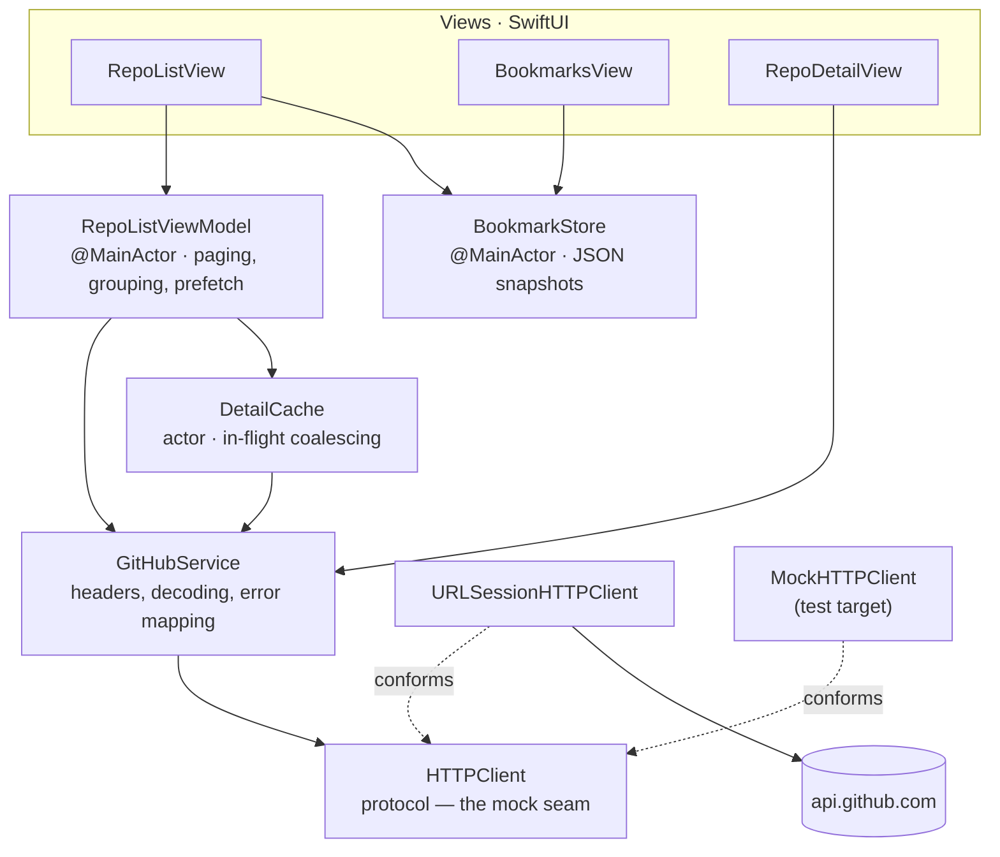

# GitHub Repo Explorer

A fully native iOS app that explores GitHub's public repositories. SwiftUI, modern Swift concurrency, zero third-party dependencies.

## 🚀 Features

- **Public Repo Discovery**: Fetches and displays public repositories from `GET /repositories`.
- **Infinite Scrolling**: Cursor-based pagination following the HTTP `Link` header (`rel="next"`) — page URLs are never guessed.
- **Grouping**: By Owner Type, Fork Status, Language, or Stargazer bands; rows inside a star band are sorted by star count.
- **Bookmarks**: Persisted locally as full snapshots — the Bookmarks tab works fully offline. Swipe to remove, long-press any row for a preview card with quick actions.
- **Graceful Error Handling**: Distinguishes offline, decoding failures, and the three different 403s GitHub can return (see below). Background failures never wipe loaded content.
- **Loading States**: Initial load, page loads, and per-repository detail fetches each have their own indicator.
- **Efficient Avatars**: Two-layer image cache (decoded in memory, raw via `URLCache`) and server-side scaling — avatars are requested at display size (`?s=192`, covering 64 pt @3x) instead of the ~460 px originals.

## 🛠 Tech Stack

- **UI**: SwiftUI (`NavigationStack`, value-based navigation), iOS 16+.
- **Architecture**: MVVM with one-way dependency flow; DI via initialisers, no singletons.
- **Concurrency**: async/await throughout, `@MainActor` UI state, an `actor` detail cache, bounded `TaskGroup` prefetching.
- **Networking**: `URLSession` behind a thin `HTTPClient` protocol — the only mock seam.
- **Persistence**: JSON file in Application Support (injectable file URL for tests).
- **Testing**: Swift Testing framework; CI on GitHub Actions.
- **Dependencies**: none.

## 🏗 Architectural Decisions & Assumptions

### Layering & modularisation

Dependencies flow one way, with plain value `Models` shared underneath. `Networking`, `Models`, and `Caching` import no UI frameworks, so lifting them into a local Swift package (e.g. `GitHubAPIKit`) is a mechanical move; a feature-module split rides the same seams. Physical splitting is deliberately deferred — at this size it would add build overhead without payoff.

### Grouping choice
**Owner Type** is the default because the field ships in the list payload — zero extra requests. **Language** and **Stargazer bands** need data the list endpoint omits, which leads to:

### Data enrichment
`/repositories` returns a minimal representation (no `language`, no `stargazers_count`); both fields come from **one** extra request per repository (`GET /repos/{owner}/{repo}`). To keep that affordable against the rate limit:

- **Lazy**: details are fetched only when a detail-dependent grouping is selected or a detail screen opens.
- **Bounded**: prefetching runs 4-wide through a `TaskGroup` sliding window — never a stampede.
- **Coalesced & cached**: `DetailCache` is an actor with in-flight coalescing; concurrent callers for the same repository share a single request, and a cached detail serves both Language and Stars grouping.
- **Interruptible**: the crawl stops as soon as the user leaves a detail-dependent grouping, and cancels remaining work immediately when the rate limit is hit.
- Repositories whose details haven't arrived sit in a temporary *"Fetching…"* section and migrate into their real section as data lands.

### Pagination
The app follows the `rel="next"` URL from the `Link` header verbatim (`LinkHeaderParser`) — the `since` cursor is owned by the server. The infinite-scroll trigger is anchored to the **visually** last row (last section, last row), not the feed-order last item: grouping reorders rows, so the feed's last item can render anywhere in the list.

### Error handling strategy
All failures map into a typed `APIError` with user-presentable messages.

- **Terminal**: only the *initial* load failure replaces the screen with a retry state.
- **Transient**: later failures (paging, enrichment) surface as a dismissible banner; loaded content never disappears. The banner self-clears on the next successful load.
- **Cancellation is not an error**: a row's `.task` tearing down mid-request (fast scrolling, popping a screen) stays silent.
- **The three 403s**: GitHub uses 403 for primary quota exhaustion, secondary (burst) throttling, *and* per-repository restrictions such as DMCA-blocked repos — the oldest pages of `/repositories` contain a few. Rate limiting is classified **only** by `X-RateLimit-Remaining: 0` (the reset header is present on every response, so it proves nothing); a blocked repository surfaces as a plain HTTP error and never aborts the rest of the prefetch batch.

### Bookmarks are deliberately not refreshable
Bookmarks store full repository snapshots and have no pull-to-refresh: they exist to work offline, and re-fetching *n* bookmarks would cost *n* requests against a 60 req/h unauthenticated limit. Slightly stale snapshots are an acceptable trade for that.

### Observability
A transport-level `os.Logger` (`subsystem: GitHubRepoExplorer, category: HTTP`) records status, path, and quota headers per request at `.debug` — in-memory only, never persisted. It is what made the 403 taxonomy above diagnosable.

## 🧪 Testing Consideration

Unit tests target the logic most likely to break; only the transport is mocked, so view-model tests exercise real decoding, Link parsing, and error mapping end-to-end:

- **`LinkHeaderParserTests`** — real GitHub header shapes, unquoted `rel`, last page, missing header.
- **`GitHubServiceTests`** — page + cursor decoding, request headers (media type, API version, bearer token presence *and* absence), rate-limit vs blocked-repo 403 classification, decoding and 5xx mapping.
- **`RepoListViewModelTests`** — initial load, paging with de-duplication, display-order trigger anchoring, silent cancellation, banner lifecycle, section building, within-band star sorting.
- **`DetailCacheTests`** — ten concurrent callers produce exactly one request; failures are never cached.
- **`BookmarkStoreTests`** — toggle semantics, persistence across instances (including removal), corrupted-file resilience.
- **`GroupingTests` / `ModelTests` / `AvatarScalingTests`** — star-band boundaries, section ordering, model helpers, avatar URL building.

Model stubs and a URL-routing mock (`TestBuilders`) keep tests free of handwritten JSON — except in `GitHubServiceTests`, which keeps real wire-format fixtures on purpose to cover field mapping.

Every major view also has **Xcode previews** (backed by DEBUG-only sample data in `PreviewData`), including empty/error states that are awkward to reach by hand; `RepoDetailView`'s preview injects a canned client through the same environment seam production uses.

## 🔁 CI & Workflow

- **GitHub Actions** builds and runs the full test suite on every push to `main` and every pull request (simulator is selected dynamically, so runner image updates don't break the job).
- **Branch protection**: `main` only accepts pull requests, and the test check must be green before merging.
- Development followed the same flow — each fix landed as a PR with its own tests (the commit history doubles as a changelog).

## 🔧 Setup

1. Clone, open `GitHubRepoExplorer.xcodeproj` (Xcode 16+), run. Tests: ⌘U. No configuration required.
2. *(Optional)* Raise the API rate limit from 60 to 5,000 req/h while developing:
   - Create a [fine-grained token](https://github.com/settings/personal-access-tokens) — defaults are right: public repos read-only, no permissions.
   - Duplicate the scheme (leave **Shared unchecked**) and add `GITHUB_TOKEN` to its environment variables.
   - Unshared schemes live in gitignored `xcuserdata/`, so the token structurally cannot be committed. The shared scheme ships clean; CI needs no token because tests never touch the network.

## 🚀 Future Improvements

- **Persist the detail cache**: it's in-memory by design; an on-disk layer reusing GitHub's ETag/304 flow (304s don't count against quota) would survive relaunches.
- **Viewport-prioritised enrichment**: prefetching is currently exhaustive for grouping completeness; at larger scales it should prioritise rows near the viewport.
- **Snapshot tests** for rows and state views; a `URLProtocol`-based integration test.
- **iOS 17 migration**: swap `ObservableObject` for `@Observable` (finer-grained invalidation) and the environment-key boilerplate for `@Entry`.

---
**Author**: Vincent Hu
